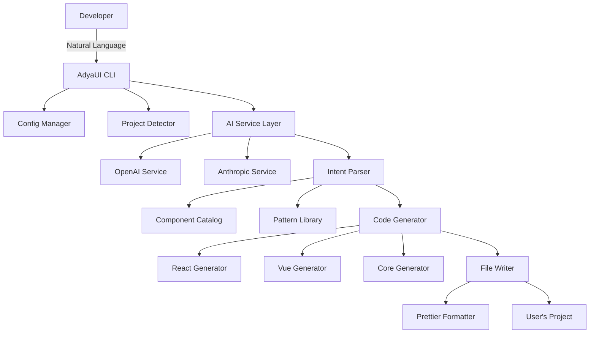

# AdyaUI AI - Technical Architecture

## System Overview



---

## Core Components

### 1. CLI Interface Layer

**Responsibility**: Handle user input and command routing

**Technologies**:
- `commander.js` - CLI framework
- `inquirer.js` - Interactive prompts
- `chalk` - Terminal colors
- `ora` - Loading spinners

**Commands**:
```typescript
interface CLICommands {
  init(options: InitOptions): Promise<void>;
  ai(options: AIOptions): Promise<void>;
  add(components: string[], options: AddOptions): Promise<void>;
}
```

---

### 2. AI Service Layer

**Responsibility**: Communicate with AI providers and parse responses

#### AI Service Interface

```typescript
export interface AIService {
  /**
   * Analyze natural language prompt and extract component intent
   */
  analyzePrompt(prompt: string, context: ProjectContext): Promise<ComponentIntent>;
  
  /**
   * Generate code based on component intent
   */
  generateCode(intent: ComponentIntent, framework: Framework): Promise<GeneratedCode>;
}

export interface ComponentIntent {
  // Type of generation
  type: 'page' | 'component' | 'layout' | 'feature';
  
  // Components to use
  components: ComponentReference[];
  
  // Layout structure
  layout?: {
    type: 'grid' | 'flex' | 'stack' | 'custom';
    columns?: number;
    gap?: string;
  };
  
  // Styling preferences
  styling?: {
    theme?: 'light' | 'dark' | 'auto';
    colors?: Record<string, string>;
    spacing?: string;
  };
  
  // Component props
  props?: Record<string, any>;
  
  // State management
  state?: StateDefinition[];
  
  // Event handlers
  events?: EventDefinition[];
}

export interface ComponentReference {
  name: string;
  props?: Record<string, any>;
  children?: ComponentReference[];
}

export interface GeneratedCode {
  filename: string;
  code: string;
  imports: string[];
  dependencies?: string[];
  styles?: string;
}
```

#### System Prompt Template

```typescript
const SYSTEM_PROMPT = `
You are an expert UI developer assistant for AdyaUI, a framework-agnostic component library.

Your task is to analyze user requests and generate component specifications.

Available Components:
${COMPONENT_CATALOG.map(c => `- ${c.name}: ${c.description}`).join('\n')}

Common Patterns:
${Object.entries(PATTERNS).map(([name, p]) => `- ${name}: ${p.description}`).join('\n')}

Response Format:
Return a JSON object with this structure:
{
  "type": "page" | "component" | "layout",
  "components": [
    {
      "name": "AuiButton",
      "props": { "variant": "primary" },
      "children": []
    }
  ],
  "layout": {
    "type": "grid",
    "columns": 3
  },
  "styling": {
    "theme": "light"
  }
}

Guidelines:
1. Use AdyaUI components whenever possible
2. Follow React/Vue best practices
3. Include proper TypeScript types
4. Add accessibility attributes
5. Use semantic HTML
6. Include error handling
7. Add loading states where appropriate
`;
```

#### OpenAI Implementation

```typescript
export class OpenAIService implements AIService {
  private client: OpenAI;
  
  constructor(apiKey: string) {
    this.client = new OpenAI({ apiKey });
  }
  
  async analyzePrompt(prompt: string, context: ProjectContext): Promise<ComponentIntent> {
    const response = await this.client.chat.completions.create({
      model: 'gpt-4-turbo-preview',
      messages: [
        { role: 'system', content: SYSTEM_PROMPT },
        { role: 'user', content: this.buildUserPrompt(prompt, context) }
      ],
      response_format: { type: 'json_object' },
      temperature: 0.7,
    });
    
    const content = response.choices[0].message.content;
    return JSON.parse(content) as ComponentIntent;
  }
  
  async generateCode(intent: ComponentIntent, framework: Framework): Promise<GeneratedCode> {
    const generator = this.getGenerator(framework);
    return generator.generate(intent);
  }
  
  private buildUserPrompt(prompt: string, context: ProjectContext): string {
    return `
Project Context:
- Framework: ${context.framework}
- TypeScript: ${context.typescript}
- Styling: ${context.styleFormat}

User Request:
${prompt}

Generate a component specification that matches this request.
    `.trim();
  }
}
```

---

### 3. Component Catalog

**Responsibility**: Maintain metadata about all AdyaUI components

```typescript
export interface ComponentMetadata {
  name: string;
  category: ComponentCategory;
  description: string;
  props: PropDefinition[];
  events: EventDefinition[];
  slots?: SlotDefinition[];
  examples: string[];
  keywords: string[];
  relatedComponents: string[];
}

export type ComponentCategory = 
  | 'form'
  | 'layout'
  | 'navigation'
  | 'feedback'
  | 'data-display'
  | 'overlay';

export interface PropDefinition {
  name: string;
  type: string;
  required: boolean;
  default?: any;
  description: string;
}

export const COMPONENT_CATALOG: ComponentMetadata[] = [
  {
    name: 'AuiButton',
    category: 'form',
    description: 'Versatile button component with multiple variants and sizes',
    props: [
      {
        name: 'variant',
        type: '"primary" | "secondary" | "outlined" | "text"',
        required: false,
        default: 'primary',
        description: 'Visual style variant'
      },
      {
        name: 'size',
        type: '"small" | "medium" | "large"',
        required: false,
        default: 'medium',
        description: 'Button size'
      },
      {
        name: 'disabled',
        type: 'boolean',
        required: false,
        default: false,
        description: 'Disable button interaction'
      },
      {
        name: 'fullWidth',
        type: 'boolean',
        required: false,
        default: false,
        description: 'Make button full width'
      }
    ],
    events: [
      {
        name: 'click',
        description: 'Fired when button is clicked',
        payload: 'MouseEvent'
      }
    ],
    examples: [
      'Login button',
      'Submit form',
      'Call to action',
      'Add to cart',
      'Delete item'
    ],
    keywords: ['button', 'click', 'action', 'submit', 'cta', 'primary', 'secondary'],
    relatedComponents: ['AuiIconButton', 'AuiButtonGroup']
  },
  // ... more components
];
```

---

### 4. Pattern Library

**Responsibility**: Define common UI patterns and their component compositions

```typescript
export interface UIPattern {
  name: string;
  description: string;
  category: string;
  components: ComponentReference[];
  layout: LayoutDefinition;
  code?: {
    react?: string;
    vue?: string;
  };
}

export const PATTERNS: Record<string, UIPattern> = {
  'login-page': {
    name: 'Login Page',
    description: 'Standard login page with email and password',
    category: 'authentication',
    components: [
      {
        name: 'AuiCard',
        props: { elevation: 2 },
        children: [
          { name: 'AuiTextField', props: { label: 'Email', type: 'email' } },
          { name: 'AuiTextField', props: { label: 'Password', type: 'password' } },
          { name: 'AuiButton', props: { variant: 'primary', fullWidth: true } }
        ]
      }
    ],
    layout: {
      type: 'flex',
      direction: 'column',
      align: 'center',
      justify: 'center'
    }
  },
  
  'product-grid': {
    name: 'Product Grid',
    description: 'Grid of product cards for e-commerce',
    category: 'e-commerce',
    components: [
      {
        name: 'AuiCard',
        props: { hoverable: true },
        children: [
          { name: 'img', props: { alt: 'Product' } },
          { name: 'h3', props: {} },
          { name: 'AuiChip', props: { label: 'Price' } },
          { name: 'AuiButton', props: { variant: 'primary', size: 'small' } }
        ]
      }
    ],
    layout: {
      type: 'grid',
      columns: 3,
      gap: '1rem'
    }
  },
  
  'dashboard-stats': {
    name: 'Dashboard Stats',
    description: 'Row of metric cards showing key statistics',
    category: 'dashboard',
    components: [
      {
        name: 'AuiCard',
        props: {},
        children: [
          { name: 'AuiIcon', props: { name: 'users' } },
          { name: 'h2', props: {} },
          { name: 'p', props: {} }
        ]
      }
    ],
    layout: {
      type: 'grid',
      columns: 4,
      gap: '1rem'
    }
  }
};
```

---

### 5. Code Generators

**Responsibility**: Generate framework-specific code from component intent

#### Base Generator

```typescript
export abstract class BaseGenerator {
  protected framework: Framework;
  protected typescript: boolean;
  
  abstract generateComponent(intent: ComponentIntent): string;
  abstract generateImports(components: string[]): string;
  abstract generateProps(props: Record<string, any>): string;
  abstract generateState(state: StateDefinition[]): string;
  abstract generateEventHandlers(events: EventDefinition[]): string;
  
  async formatCode(code: string): Promise<string> {
    return prettier.format(code, {
      parser: this.typescript ? 'typescript' : 'babel',
      semi: true,
      singleQuote: true,
      tabWidth: 2,
    });
  }
}
```

#### React Generator

```typescript
export class ReactGenerator extends BaseGenerator {
  generateComponent(intent: ComponentIntent): string {
    const imports = this.generateImports(intent.components.map(c => c.name));
    const props = this.generateProps(intent.props || {});
    const state = this.generateState(intent.state || []);
    const handlers = this.generateEventHandlers(intent.events || []);
    const jsx = this.generateJSX(intent.components, intent.layout);
    
    return `
${imports}

${props}

export const ${this.getComponentName(intent)}: React.FC<${this.getPropsTypeName(intent)}> = (props) => {
  ${state}
  ${handlers}
  
  return (
    ${jsx}
  );
};
    `.trim();
  }
  
  generateImports(components: string[]): string {
    const auiComponents = components.filter(c => c.startsWith('Aui'));
    return `
import React from 'react';
import { ${auiComponents.join(', ')} } from '@adyaui/react';
import '@adyaui/core/dist/theme.css';
    `.trim();
  }
  
  generateJSX(components: ComponentReference[], layout?: LayoutDefinition): string {
    const layoutClass = layout ? this.getLayoutClass(layout) : '';
    
    return `
<div className="${layoutClass}">
  ${components.map(c => this.generateComponentJSX(c)).join('\n  ')}
</div>
    `.trim();
  }
  
  private generateComponentJSX(component: ComponentReference): string {
    const props = Object.entries(component.props || {})
      .map(([key, value]) => `${key}={${JSON.stringify(value)}}`)
      .join(' ');
    
    if (component.children && component.children.length > 0) {
      return `
<${component.name} ${props}>
  ${component.children.map(c => this.generateComponentJSX(c)).join('\n  ')}
</${component.name}>
      `.trim();
    }
    
    return `<${component.name} ${props} />`;
  }
}
```

#### Vue Generator

```typescript
export class VueGenerator extends BaseGenerator {
  generateComponent(intent: ComponentIntent): string {
    const imports = this.generateImports(intent.components.map(c => c.name));
    const props = this.generateProps(intent.props || {});
    const state = this.generateState(intent.state || []);
    const handlers = this.generateEventHandlers(intent.events || []);
    const template = this.generateTemplate(intent.components, intent.layout);
    const styles = this.generateStyles(intent.styling);
    
    return `
<template>
  ${template}
</template>

<script setup lang="ts">
${imports}

${props}
${state}
${handlers}
</script>

<style scoped>
${styles}
</style>
    `.trim();
  }
  
  generateTemplate(components: ComponentReference[], layout?: LayoutDefinition): string {
    const layoutClass = layout ? this.getLayoutClass(layout) : '';
    
    return `
<div class="${layoutClass}">
  ${components.map(c => this.generateComponentTemplate(c)).join('\n  ')}
</div>
    `.trim();
  }
}
```

---

### 6. File Writer

**Responsibility**: Write generated code to the file system safely

```typescript
export class FileWriter {
  async writeComponent(
    code: GeneratedCode,
    outputDir: string,
    options: WriteOptions
  ): Promise<WriteResult> {
    const filePath = path.join(outputDir, code.filename);
    
    // Check if file exists
    if (await this.fileExists(filePath) && !options.force) {
      if (options.interactive) {
        const overwrite = await this.promptOverwrite(filePath);
        if (!overwrite) {
          return { success: false, reason: 'user-cancelled' };
        }
      } else {
        throw new Error(`File already exists: ${filePath}`);
      }
    }
    
    // Create backup if file exists
    if (await this.fileExists(filePath)) {
      await this.createBackup(filePath);
    }
    
    // Format code
    const formatted = await this.formatCode(code.code, code.filename);
    
    // Write file
    await fs.writeFile(filePath, formatted, 'utf-8');
    
    // Write styles if present
    if (code.styles) {
      const styleFile = this.getStyleFilename(code.filename);
      await fs.writeFile(path.join(outputDir, styleFile), code.styles, 'utf-8');
    }
    
    return {
      success: true,
      files: [filePath, code.styles ? path.join(outputDir, this.getStyleFilename(code.filename)) : null].filter(Boolean)
    };
  }
  
  private async createBackup(filePath: string): Promise<void> {
    const backupPath = `${filePath}.backup.${Date.now()}`;
    await fs.copyFile(filePath, backupPath);
  }
}
```

---

## Data Flow

### 1. User Input → AI Analysis

```
User: "Create a login page with email and password"
  ↓
CLI: Parse command and options
  ↓
AI Service: Analyze prompt with context
  ↓
OpenAI: Return ComponentIntent JSON
  ↓
{
  "type": "page",
  "components": [
    {
      "name": "AuiCard",
      "children": [
        { "name": "AuiTextField", "props": { "label": "Email", "type": "email" } },
        { "name": "AuiTextField", "props": { "label": "Password", "type": "password" } },
        { "name": "AuiButton", "props": { "variant": "primary" } }
      ]
    }
  ],
  "layout": { "type": "flex", "align": "center" }
}
```

### 2. Intent → Code Generation

```
ComponentIntent
  ↓
Code Generator (React/Vue/Core)
  ↓
GeneratedCode {
  filename: "LoginPage.tsx",
  code: "import React from 'react'...",
  imports: ["@adyaui/react"],
  styles: ".container { ... }"
}
```

### 3. Code → File System

```
GeneratedCode
  ↓
File Writer
  ↓
- Check conflicts
- Create backup
- Format code
- Write files
  ↓
User's Project
```

---

## Error Handling

```typescript
export class AIError extends Error {
  constructor(
    message: string,
    public code: ErrorCode,
    public details?: any
  ) {
    super(message);
  }
}

export enum ErrorCode {
  API_KEY_MISSING = 'API_KEY_MISSING',
  API_REQUEST_FAILED = 'API_REQUEST_FAILED',
  INVALID_RESPONSE = 'INVALID_RESPONSE',
  FRAMEWORK_NOT_DETECTED = 'FRAMEWORK_NOT_DETECTED',
  FILE_WRITE_ERROR = 'FILE_WRITE_ERROR',
  COMPONENT_NOT_FOUND = 'COMPONENT_NOT_FOUND',
}

// Usage
try {
  await aiService.analyzePrompt(prompt, context);
} catch (error) {
  if (error instanceof AIError) {
    switch (error.code) {
      case ErrorCode.API_KEY_MISSING:
        console.error('Please set ADYAUI_AI_API_KEY environment variable');
        break;
      case ErrorCode.API_REQUEST_FAILED:
        console.error('AI service is unavailable. Please try again later.');
        break;
      // ... handle other errors
    }
  }
}
```

---

## Performance Considerations

### 1. Caching

```typescript
export class CachedAIService implements AIService {
  private cache = new Map<string, ComponentIntent>();
  
  async analyzePrompt(prompt: string, context: ProjectContext): Promise<ComponentIntent> {
    const cacheKey = this.getCacheKey(prompt, context);
    
    if (this.cache.has(cacheKey)) {
      return this.cache.get(cacheKey)!;
    }
    
    const result = await this.aiService.analyzePrompt(prompt, context);
    this.cache.set(cacheKey, result);
    
    return result;
  }
}
```

### 2. Streaming Responses

```typescript
async analyzePromptStream(
  prompt: string,
  onChunk: (chunk: Partial<ComponentIntent>) => void
): Promise<ComponentIntent> {
  const stream = await this.client.chat.completions.create({
    model: 'gpt-4-turbo-preview',
    messages: [...],
    stream: true,
  });
  
  for await (const chunk of stream) {
    const delta = chunk.choices[0]?.delta?.content;
    if (delta) {
      onChunk(JSON.parse(delta));
    }
  }
}
```

---

## Security

### 1. API Key Management

- Never store API keys in code
- Support environment variables
- Encrypt keys in config file
- Validate API key format

### 2. Code Injection Prevention

- Sanitize user input
- Validate AI responses
- Use safe code generation
- Prevent arbitrary code execution

---

## Testing Strategy

### 1. Unit Tests

- Test each generator independently
- Mock AI service responses
- Test file writer edge cases

### 2. Integration Tests

- Test full flow from prompt to file
- Test with real AI API (in CI)
- Test all framework generators

### 3. E2E Tests

- Test CLI commands
- Test in real projects
- Verify generated code compiles

---

**This architecture provides a solid foundation for the AdyaUI AI CLI system.**
