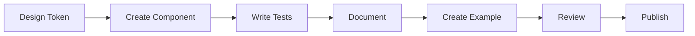

# Getting Started with AdyaUI Development

## 🎯 Quick Start Guide

This guide will walk you through setting up the AdyaUI development environment and creating your first component.

---

## 📋 Prerequisites

Before starting, ensure you have:

- **Node.js**: v18+ (LTS recommended)
- **pnpm**: v8+ (package manager)
- **Git**: Latest version
- **Code Editor**: VS Code recommended

### Install pnpm (if not installed)
```bash
npm install -g pnpm
```

---

## 🏗️ Project Structure

```
adyaui/
├── packages/
│   ├── core/                      # Main Web Components library
│   │   ├── src/
│   │   │   ├── components/        # All components
│   │   │   │   ├── button/
│   │   │   │   │   ├── aui-button.ts
│   │   │   │   │   ├── aui-button.styles.ts
│   │   │   │   │   └── index.ts
│   │   │   │   └── ...
│   │   │   ├── theme/             # Theme system
│   │   │   ├── utils/             # Utilities
│   │   │   ├── base/              # Base classes
│   │   │   └── index.ts
│   │   ├── package.json
│   │   └── tsconfig.json
│   │
│   ├── react/                     # React wrapper
│   │   ├── src/
│   │   ├── package.json
│   │   └── tsconfig.json
│   │
│   ├── vue/                       # Vue wrapper
│   ├── angular/                   # Angular wrapper
│   ├── svelte/                    # Svelte wrapper
│   ├── theme/                     # Design tokens
│   ├── icons/                     # Icon library
│   └── utils/                     # Shared utilities
│
├── docs/                          # VitePress documentation
│   ├── .vitepress/
│   ├── guide/
│   ├── components/
│   └── examples/
│
├── examples/                      # Example applications
│   ├── vanilla-js/
│   ├── react-app/
│   ├── vue-app/
│   └── angular-app/
│
├── tools/                         # Build tools
│   └── scripts/
│
├── pnpm-workspace.yaml           # pnpm workspace config
├── package.json                  # Root package.json
├── tsconfig.json                 # Root TypeScript config
├── .gitignore
└── README.md
```

---

## 🚀 Initial Setup Steps

### Step 1: Initialize the Monorepo

```bash
# Navigate to your project directory
cd c:/Users/vinay/Downloads/AdyaUI

# Initialize git (if not already done)
git init

# Create pnpm workspace configuration
# This will be created automatically

# Install dependencies
pnpm install
```

### Step 2: Understanding Web Components

AdyaUI uses **Web Components** as the foundation because they are:
- ✅ Framework-agnostic (work everywhere)
- ✅ Native browser APIs (no runtime overhead)
- ✅ Encapsulated (Shadow DOM)
- ✅ Reusable across all frameworks

**Example Web Component:**
```typescript
class AuiButton extends HTMLElement {
  constructor() {
    super();
    this.attachShadow({ mode: 'open' });
  }
  
  connectedCallback() {
    this.render();
  }
  
  render() {
    this.shadowRoot.innerHTML = `
      <style>
        button {
          padding: 8px 16px;
          background: var(--aui-primary);
          color: white;
          border: none;
          border-radius: 4px;
          cursor: pointer;
        }
      </style>
      <button><slot></slot></button>
    `;
  }
}

customElements.define('aui-button', AuiButton);
```

### Step 3: Build Your First Component

We'll create the **Button** component as our starting point.

---

## 🎨 Design System Foundation

### Color Palette
```css
:root {
  /* Primary Colors */
  --aui-primary-50: #e3f2fd;
  --aui-primary-100: #bbdefb;
  --aui-primary-200: #90caf9;
  --aui-primary-300: #64b5f6;
  --aui-primary-400: #42a5f5;
  --aui-primary-500: #2196f3;
  --aui-primary-600: #1e88e5;
  --aui-primary-700: #1976d2;
  --aui-primary-800: #1565c0;
  --aui-primary-900: #0d47a1;
  
  /* Semantic Colors */
  --aui-primary: var(--aui-primary-500);
  --aui-secondary: #9c27b0;
  --aui-success: #4caf50;
  --aui-error: #f44336;
  --aui-warning: #ff9800;
  --aui-info: #2196f3;
  
  /* Neutral Colors */
  --aui-gray-50: #fafafa;
  --aui-gray-100: #f5f5f5;
  --aui-gray-200: #eeeeee;
  --aui-gray-300: #e0e0e0;
  --aui-gray-400: #bdbdbd;
  --aui-gray-500: #9e9e9e;
  --aui-gray-600: #757575;
  --aui-gray-700: #616161;
  --aui-gray-800: #424242;
  --aui-gray-900: #212121;
  
  /* Typography */
  --aui-font-family: 'Roboto', -apple-system, BlinkMacSystemFont, 'Segoe UI', sans-serif;
  --aui-font-size-xs: 0.75rem;
  --aui-font-size-sm: 0.875rem;
  --aui-font-size-md: 1rem;
  --aui-font-size-lg: 1.125rem;
  --aui-font-size-xl: 1.25rem;
  --aui-font-size-2xl: 1.5rem;
  
  /* Spacing */
  --aui-spacing-xs: 4px;
  --aui-spacing-sm: 8px;
  --aui-spacing-md: 16px;
  --aui-spacing-lg: 24px;
  --aui-spacing-xl: 32px;
  
  /* Border Radius */
  --aui-radius-sm: 4px;
  --aui-radius-md: 8px;
  --aui-radius-lg: 12px;
  --aui-radius-full: 9999px;
  
  /* Shadows */
  --aui-shadow-sm: 0 1px 2px 0 rgba(0, 0, 0, 0.05);
  --aui-shadow-md: 0 4px 6px -1px rgba(0, 0, 0, 0.1);
  --aui-shadow-lg: 0 10px 15px -3px rgba(0, 0, 0, 0.1);
  --aui-shadow-xl: 0 20px 25px -5px rgba(0, 0, 0, 0.1);
  
  /* Transitions */
  --aui-transition-fast: 150ms ease-in-out;
  --aui-transition-base: 250ms ease-in-out;
  --aui-transition-slow: 350ms ease-in-out;
}
```

---

## 🛠️ Development Workflow

### 1. Component Development Cycle



### 2. Commands

```bash
# Install dependencies
pnpm install

# Start development
pnpm dev

# Build all packages
pnpm build

# Run tests
pnpm test

# Lint code
pnpm lint

# Format code
pnpm format

# Start documentation site
pnpm docs:dev

# Build documentation
pnpm docs:build
```

---

## 📝 Component Development Checklist

For each new component, ensure:

- [ ] TypeScript implementation with proper types
- [ ] Shadow DOM encapsulation
- [ ] CSS custom properties for theming
- [ ] Accessible (ARIA labels, keyboard navigation)
- [ ] Responsive design
- [ ] Unit tests (Vitest)
- [ ] E2E tests (Playwright)
- [ ] Documentation page
- [ ] Interactive examples
- [ ] Framework wrappers (React, Vue, Angular, etc.)

---

## 🎯 Next Steps

Now that you understand the structure, let's:

1. **Setup the monorepo structure** - Create all necessary folders and config files
2. **Install dependencies** - Setup build tools, TypeScript, testing frameworks
3. **Create the Button component** - Build our first component
4. **Setup documentation** - Create VitePress documentation site
5. **Create framework wrappers** - Start with React wrapper

---

## 📚 Learning Resources

- **Web Components**: https://developer.mozilla.org/en-US/docs/Web/Web_Components
- **Custom Elements**: https://developers.google.com/web/fundamentals/web-components/customelements
- **Shadow DOM**: https://developers.google.com/web/fundamentals/web-components/shadowdom
- **Lit**: https://lit.dev/ (excellent Web Components library for reference)
- **Material Design**: https://material.io/design

---

## 💡 Pro Tips

1. **Start Simple**: Begin with basic components (Button, Input) before complex ones
2. **Test Early**: Write tests as you develop, not after
3. **Document Everything**: Good documentation = good adoption
4. **Think Composability**: Components should be composable
5. **Performance Matters**: Keep bundle size small, lazy load when possible
6. **Accessibility First**: Build accessible components from the start

---

**Ready to start building? Let's create the initial project structure! 🚀**
