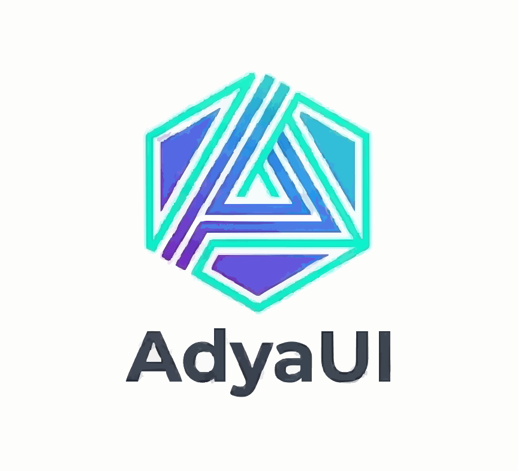

# AdyaUI (AUI) 🚀

<div align="center">



**A beautiful, accessible, and framework-agnostic UI component library**

[](https://www.npmjs.com/package/adya-ui-core)
[](https://www.npmjs.com/package/adya-ui-react)
[](https://www.npmjs.com/package/adya-ui-vue)
[](https://www.npmjs.com/package/adya-ui-cli)
[](https://opensource.org/licenses/MIT)
[](https://www.typescriptlang.org/)
[](https://bundlephobia.com/package/adya-ui-core)

[Documentation](https://adyaui.dev) · [Components](https://adyaui.dev/components) · [Examples](https://adyaui.dev/examples) · [Playground](https://adyaui.dev/playground)

</div>

---

## ✨ Features

- 🤖 **AI-Powered Generation** - Generate components using natural language prompts (NEW!)
- 🎨 **Beautiful Design** - Modern, sleek components inspired by Material Design
- 🔧 **Framework Agnostic** - Works with React, Vue, Angular, Svelte, and vanilla JS
- ♿ **Accessible** - WCAG 2.1 AA compliant with full keyboard navigation
- 🎭 **Themeable** - Powerful theming system with CSS custom properties
- 📦 **Lightweight** - Tree-shakeable with minimal bundle size
- 🌙 **Dark Mode** - Built-in dark mode support
- 🚀 **TypeScript** - Full TypeScript support with type definitions
- 📱 **Responsive** - Mobile-first, fully responsive components
- 🧩 **Composable** - Build complex UIs with simple, composable components
- ⚡ **Fast** - Built on native Web Components for optimal performance

---

## 📦 Installation

### AI CLI (Recommended)

```bash
# Install globally
npm install -g adya-ui-cli

# Or use with npx (no installation needed)
npx adya-ui-cli init
```

### Component Libraries

```bash
# Core (Web Components)
npm install adya-ui-core

# React
npm install adya-ui-react

# Vue
npm install adya-ui-vue
```

### Using CDN

```html
<!-- Core library -->
<script type="module" src="https://cdn.jsdelivr.net/npm/adya-ui-core"></script>

<!-- Theme (optional) -->
<link rel="stylesheet" href="https://cdn.jsdelivr.net/npm/adya-ui-core/dist/theme.css">
```

---

## 🚀 Quick Start

### Vanilla JavaScript / HTML

```html
<!DOCTYPE html>
<html lang="en">
<head>
  <meta charset="UTF-8">
  <meta name="viewport" content="width=device-width, initial-scale=1.0">
  <title>AdyaUI Demo</title>
  <script type="module" src="https://cdn.jsdelivr.net/npm/@adyaui/core"></script>
</head>
<body>
  <aui-button variant="primary">Click Me!</aui-button>
  <aui-text-field label="Name" placeholder="Enter your name"></aui-text-field>
  
  <script>
    const button = document.querySelector('aui-button');
    button.addEventListener('click', () => {
      alert('Button clicked!');
    });
  </script>
</body>
</html>
```

### React

```jsx
import { AuiButton, AuiTextField } from '@adyaui/react';
import '@adyaui/core/dist/theme.css';

function App() {
  const handleClick = () => {
    console.log('Button clicked!');
  };

  return (
    <div>
      <AuiButton variant="primary" onClick={handleClick}>
        Click Me!
      </AuiButton>
      <AuiTextField label="Name" placeholder="Enter your name" />
    </div>
  );
}
```

### Vue

```vue
<template>
  <div>
    <aui-button variant="primary" @click="handleClick">
      Click Me!
    </aui-button>
    <aui-text-field label="Name" placeholder="Enter your name" />
  </div>
</template>

<script setup>
import { AuiButton, AuiTextField } from '@adyaui/vue';
import '@adyaui/core/dist/theme.css';

const handleClick = () => {
  console.log('Button clicked!');
};
</script>
```

### Angular

```typescript
import { Component } from '@angular/core';
import '@adyaui/core';
import '@adyaui/core/dist/theme.css';

@Component({
  selector: 'app-root',
  template: `
    <aui-button variant="primary" (click)="handleClick()">
      Click Me!
    </aui-button>
    <aui-text-field label="Name" placeholder="Enter your name"></aui-text-field>
  `
})
export class AppComponent {
  handleClick() {
    console.log('Button clicked!');
  }
}
```

---

## 🤖 AI-Powered Component Generation

**NEW!** Generate UI components using natural language with AdyaUI AI CLI.

### Quick Start

```bash
# Install the CLI
npm install -g @adyaui/cli

# Initialize in your project
cd my-app
adya-ui init

# Generate components with AI
adya-ui ai
```

### Example Usage

```bash
# Create a login page
adya-ui ai -p "Create a login page with email and password fields"

# Build a product grid
adya-ui ai -p "Build a product grid with 3 columns, showing image, title, price, and add to cart button"

# Generate a dashboard
adya-ui ai -p "Create a dashboard with sidebar, header, and 4 stat cards"
```

### What Makes This Special?

- 🎯 **Intent-Based**: Describe what you want, not how to build it
- 🚀 **Framework-Aware**: Generates React, Vue, or vanilla code automatically
- 📚 **Pattern Library**: Knows common UI patterns (login, checkout, dashboard, etc.)
- ✨ **Production-Ready**: Generates clean, typed, accessible code
- 🔄 **Iterative**: Preview before creating, refine with follow-up prompts

[Learn more about AI CLI →](./CLI_GUIDE.md) | [Example Prompts →](./AI_PROMPTS.md)

---

## 🎨 Components

### Available Components

- ✅ **Button** - Buttons with multiple variants
- ✅ **TextField** - Input fields with validation
- ✅ **Select** - Dropdown selection
- ✅ **Checkbox** - Checkboxes and checkbox groups
- ✅ **Radio** - Radio buttons and groups
- ✅ **Switch** - Toggle switches
- ✅ **Card** - Content containers
- ✅ **Dialog** - Modal dialogs
- ✅ **Alert** - Alert messages
- ✅ **Tooltip** - Contextual tooltips
- ✅ **Progress** - Progress indicators
- ✅ **Table** - Data tables
- 🚧 **DatePicker** - Date selection (Coming soon)
- 🚧 **Autocomplete** - Search with suggestions (Coming soon)
- 🚧 **DataGrid** - Advanced data tables (Coming soon)

[View all components →](https://adyaui.dev/components)

---

## 🎭 Theming

AdyaUI uses CSS custom properties for theming, making it easy to customize:

```css
:root {
  --aui-primary: #2196f3;
  --aui-secondary: #9c27b0;
  --aui-success: #4caf50;
  --aui-error: #f44336;
  --aui-font-family: 'Inter', sans-serif;
  --aui-border-radius: 8px;
}
```

### Dark Mode

```javascript
// Toggle dark mode
document.documentElement.setAttribute('data-theme', 'dark');
```

[Learn more about theming →](https://adyaui.dev/theming)

---

## 🏗️ Project Structure

```
adyaui/
├── packages/
│   ├── core/          # Web Components core
│   ├── react/         # React wrapper
│   ├── vue/           # Vue wrapper
│   ├── angular/       # Angular wrapper
│   ├── svelte/        # Svelte wrapper
│   ├── theme/         # Design tokens
│   └── utils/         # Utilities
├── docs/              # Documentation
└── examples/          # Example apps
```

---

## 🤝 Contributing

We welcome contributions! Please see our [Contributing Guide](CONTRIBUTING.md) for details.

### Development Setup

```bash
# Clone the repository
git clone https://github.com/yourusername/adyaui.git
cd adyaui

# Install dependencies
pnpm install

# Start development
pnpm dev

# Run tests
pnpm test

# Build all packages
pnpm build
```

---

## 📖 Documentation

Full documentation is available at [adyaui.dev](https://adyaui.dev)

- [Getting Started](https://adyaui.dev/guide/getting-started)
- [Component API](https://adyaui.dev/components)
- [Theming Guide](https://adyaui.dev/theming)
- [Accessibility](https://adyaui.dev/accessibility)
- [Examples](https://adyaui.dev/examples)

---

## 🗺️ Roadmap

See our [detailed roadmap](ROADMAP.md) for upcoming features and improvements.

### Current Status: **v0.0.1 - Foundation Phase**

- [x] Project setup
- [x] Design system
- [x] Build pipeline
- [ ] Core components (In Progress)
- [ ] Documentation site
- [ ] Framework wrappers
- [ ] v1.0.0 Release

---

## 📄 License

MIT © AdyaUI Team

---

## 🙏 Acknowledgments

- Inspired by [Material-UI](https://mui.com/), [Shoelace](https://shoelace.style/), and [Chakra UI](https://chakra-ui.com/)
- Built with [Web Components](https://developer.mozilla.org/en-US/docs/Web/Web_Components)
- Icons from [Material Icons](https://fonts.google.com/icons)

---

<div align="center">

**Made with ❤️ by the AdyaUI Team**

[Website](https://adyaui.dev) · [Twitter](https://twitter.com/adyaui) · [Discord](https://discord.gg/adyaui)

</div>
