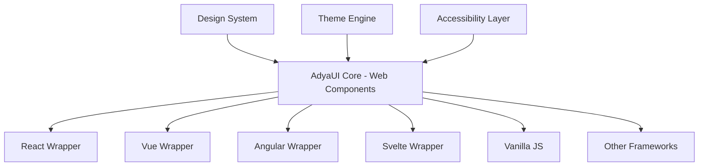

# AdyaUI (AUI) - Development Roadmap

> A framework-agnostic UI component library inspired by Material-UI

## 🎯 Project Vision

Create a beautiful, accessible, and performant UI component library that works seamlessly with **all** JavaScript frameworks (React, Vue, Angular, Svelte, Solid, etc.) and vanilla JavaScript.

## 🏗️ Architecture Overview



### Technology Stack

- **Core**: Web Components (Custom Elements, Shadow DOM)
- **Language**: TypeScript
- **Build Tool**: Vite + Rollup
- **Styling**: CSS Custom Properties + CSS-in-JS support
- **Testing**: Vitest + Playwright
- **Documentation**: VitePress
- **Monorepo**: pnpm workspaces

---

## 📅 Phase 1: Foundation (Weeks 1-3)

### Week 1: Project Setup & Design System

- [ ] Initialize monorepo structure
- [ ] Setup TypeScript configuration
- [ ] Configure build pipeline (Vite + Rollup)
- [ ] Define design tokens
  - [ ] Color palette
  - [ ] Typography scale
  - [ ] Spacing system
  - [ ] Elevation/shadows
  - [ ] Border radius
  - [ ] Transitions/animations
- [ ] Create theme engine architecture
- [ ] Setup documentation site (VitePress)

### Week 2: Core Infrastructure

- [ ] Create base Web Component class
- [ ] Implement theming system
- [ ] Build CSS custom properties manager
- [ ] Setup event system
- [ ] Create utilities
  - [ ] DOM helpers
  - [ ] Color manipulation
  - [ ] Accessibility utilities
- [ ] Setup testing infrastructure

### Week 3: First Components

- [ ] **Button** (Primary, Secondary, Outlined, Text, Icon)
- [ ] **Icon** system integration
- [ ] **Typography** components
- [ ] **Container** & **Grid** layout
- [ ] Write comprehensive tests
- [ ] Create documentation pages

---

## 📅 Phase 2: Core Components (Weeks 4-8)

### Week 4-5: Form Components

- [ ] **TextField** / **Input**
- [ ] **Select** / **Dropdown**
- [ ] **Checkbox**
- [ ] **Radio**
- [ ] **Switch**
- [ ] **Slider**
- [ ] **Form** wrapper with validation
- [ ] **FormHelperText**

### Week 6-7: Feedback Components

- [ ] **Alert** / **Snackbar**
- [ ] **Dialog** / **Modal**
- [ ] **Progress** (Linear & Circular)
- [ ] **Skeleton**
- [ ] **Tooltip**
- [ ] **Popover**
- [ ] **Badge**

### Week 8: Navigation Components

- [ ] **AppBar** / **Toolbar**
- [ ] **Drawer** / **Sidebar**
- [ ] **Tabs**
- [ ] **Breadcrumbs**
- [ ] **Menu** / **Dropdown Menu**
- [ ] **BottomNavigation**
- [ ] **Stepper**

---

## 📅 Phase 3: Advanced Components (Weeks 9-12)

### Week 9-10: Data Display

- [ ] **Table** (with sorting, pagination, filtering)
- [ ] **DataGrid** (advanced table)
- [ ] **List** / **ListItem**
- [ ] **Card**
- [ ] **Accordion** / **Expansion Panel**
- [ ] **Chip**
- [ ] **Avatar**
- [ ] **Divider**

### Week 11: Complex Components

- [ ] **DatePicker**
- [ ] **TimePicker**
- [ ] **Autocomplete**
- [ ] **TreeView**
- [ ] **Rating**
- [ ] **Pagination**

### Week 12: Polish & Optimization

- [ ] Performance optimization
- [ ] Bundle size optimization
- [ ] Accessibility audit (WCAG 2.1 AA)
- [ ] Cross-browser testing
- [ ] Documentation improvements

---

## 📅 Phase 4: Framework Adapters (Weeks 13-16)

### Week 13: React Adapter

- [ ] Create React wrapper package (`@adyaui/react`)
- [ ] Convert Web Components to React components
- [ ] Handle React-specific props and events
- [ ] TypeScript definitions
- [ ] React-specific examples

### Week 14: Vue Adapter

- [ ] Create Vue wrapper package (`@adyaui/vue`)
- [ ] Convert Web Components to Vue components
- [ ] Handle Vue-specific directives
- [ ] TypeScript definitions
- [ ] Vue-specific examples

### Week 15: Angular Adapter

- [ ] Create Angular module (`@adyaui/angular`)
- [ ] CUSTOM_ELEMENTS_SCHEMA configuration
- [ ] Angular-specific services
- [ ] TypeScript definitions
- [ ] Angular-specific examples

### Week 16: Other Frameworks

- [ ] Svelte adapter (`@adyaui/svelte`)
- [ ] Solid.js adapter (`@adyaui/solid`)
- [ ] Framework-agnostic CDN build
- [ ] Testing all adapters

---

## 📅 Phase 5: Advanced Features (Weeks 17-20)

### Week 17: Theming & Customization

- [ ] Multiple built-in themes
  - [ ] Light theme
  - [ ] Dark theme
  - [ ] High contrast
  - [ ] Custom theme creator
- [ ] CSS variable overrides
- [ ] Runtime theme switching
- [ ] Theme builder tool

### Week 18: Developer Experience

- [ ] VS Code extension (autocomplete, snippets)
- [ ] Figma design kit
- [ ] CLI tool for scaffolding
- [ ] Code snippets library
- [ ] Migration guides

### Week 19: Documentation & Examples

- [ ] Interactive playground
- [ ] Component API documentation
- [ ] Comprehensive examples
- [ ] Best practices guide
- [ ] Accessibility guide
- [ ] Theming guide

### Week 20: Performance & Optimization

- [ ] Lazy loading support
- [ ] Tree-shaking optimization
- [ ] Performance benchmarks
- [ ] Bundle analysis
- [ ] CDN distribution

---

## 📅 Phase 6: Production Ready (Weeks 21-24)

### Week 21: Quality Assurance

- [ ] Complete test coverage (>90%)
- [ ] E2E testing suite
- [ ] Visual regression testing
- [ ] Performance testing
- [ ] Security audit

### Week 22: Advanced Patterns

- [ ] Composition patterns
- [ ] Advanced styling patterns
- [ ] State management integration
- [ ] Form validation library
- [ ] Animation library

### Week 23: Ecosystem

- [ ] Design tokens package
- [ ] Icons package
- [ ] Utilities package
- [ ] Hooks/composables package
- [ ] Templates & boilerplates

### Week 24: Launch Preparation

- [ ] Final documentation review
- [ ] Marketing website
- [ ] Changelog generation
- [ ] npm publishing setup
- [ ] GitHub Actions CI/CD
- [ ] Community guidelines
- [ ] Contributing guide

---

## 📦 Package Structure

```
adyaui/
├── packages/
│   ├── core/              # Web Components core
│   ├── react/             # React adapter
│   ├── vue/               # Vue adapter
│   ├── angular/           # Angular adapter
│   ├── svelte/            # Svelte adapter
│   ├── solid/             # Solid.js adapter
│   ├── icons/             # Icon set
│   ├── theme/             # Design tokens & themes
│   └── utils/             # Shared utilities
├── docs/                  # Documentation site
├── examples/              # Example apps
│   ├── react-example/
│   ├── vue-example/
│   ├── angular-example/
│   └── vanilla-example/
└── tools/                 # Build & dev tools
```

---

## 🎨 Component Priority List

### High Priority (MVP)

1. Button
2. TextField
3. Select
4. Checkbox
5. Radio
6. Card
7. Container/Grid
8. Typography
9. Icon
10. Alert

### Medium Priority

11. Dialog
12. Drawer
13. AppBar
14. Tabs
15. Menu
16. Tooltip
17. Progress
18. Table
19. List
20. Avatar

### Low Priority (Nice to have)

21. DatePicker
22. TimePicker
23. Autocomplete
24. DataGrid
25. TreeView
26. Timeline
27. Carousel
28. Rating
29. Pagination
30. Stepper

---

## 🚀 Success Metrics

- **Performance**: < 50KB gzipped for core components
- **Accessibility**: WCAG 2.1 AA compliance
- **Browser Support**: Last 2 versions of major browsers
- **Test Coverage**: > 90%
- **Documentation**: Every component fully documented
- **Framework Support**: React, Vue, Angular, Svelte, Solid, Vanilla JS

---

## 📚 Resources & References

- [Web Components Best Practices](https://developers.google.com/web/fundamentals/web-components)
- [Material Design Guidelines](https://material.io/design)
- [WCAG 2.1 Guidelines](https://www.w3.org/WAI/WCAG21/quickref/)
- [Lit Element](https://lit.dev/) - Reference for Web Components
- [Shoelace](https://shoelace.style/) - Similar library for inspiration
- [Open UI](https://open-ui.org/) - Component standards

---

## 🎯 Next Immediate Steps

1. ✅ Review and approve this roadmap
2. Initialize monorepo structure
3. Setup design tokens
4. Create first component (Button)
5. Setup documentation site

---

**Let's build something amazing! 🚀**
